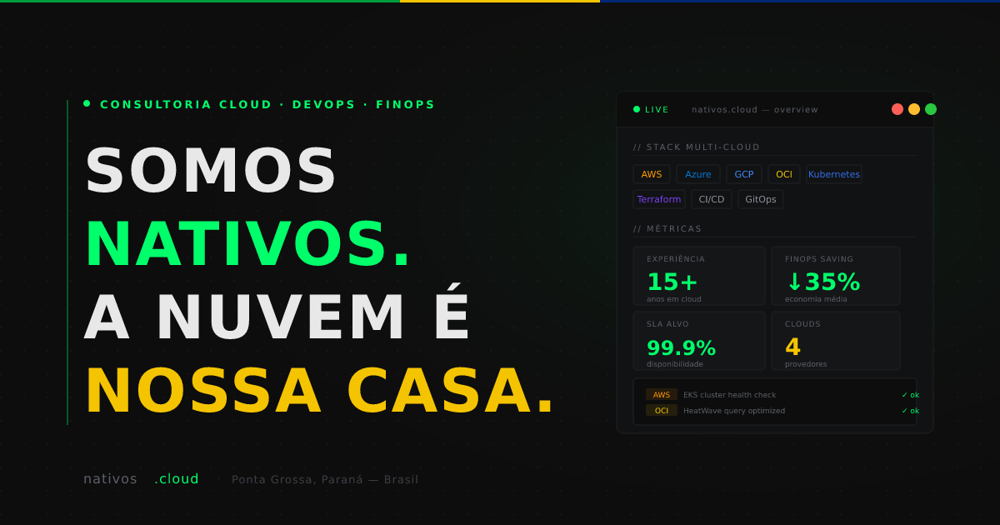

# nativos.cloud

[](https://github.com/nativos-cloud/nativos-cloud-site/actions/workflows/static.yml)
[](https://nativos.cloud)
[](https://github.com/nativos-cloud/nativos-cloud-site/commits/main)


Site institucional da [nativos.cloud](https://nativos.cloud) — consultoria especializada em Cloud, DevOps e FinOps para empresas brasileiras.



## Stack

- HTML, CSS e JavaScript puros — sem frameworks ou dependências de build
- [EmailJS](https://www.emailjs.com/) para envio do formulário de contato
- [Simple Icons](https://simpleicons.org/) para os logos de tecnologia no marquee

## Estrutura

```
index.html                      # Página principal
404.html                        # Página de erro customizada
politica-de-privacidade.html    # Política de privacidade (LGPD)
favicon.svg                     # Favicon (crawlável pelo Google)
og-image.png                    # Imagem Open Graph (redes sociais / cards)
robots.txt                      # Diretivas para crawlers
sitemap.xml                     # Sitemap para indexação
serve.py                        # Servidor local de desenvolvimento
```

## Pré-requisitos

- Python 3 (para o servidor local)

## Desenvolvimento local

```bash
python3 serve.py
```

Abre em `http://localhost:8080`. A página 404 customizada também funciona localmente.

O servidor aplica os mesmos headers de segurança de produção (CSP, `X-Frame-Options`, `Referrer-Policy`, etc.), garantindo paridade entre os ambientes.

## Configuração do EmailJS

O formulário de contato usa [EmailJS](https://www.emailjs.com/). Para funcionar em ambiente local ou em um fork, são necessárias três credenciais configuradas diretamente no `index.html`:

| Variável | Onde encontrar no painel do EmailJS |
|---|---|
| `publicKey` | Account → API Keys |
| `service_id` | Email Services → Service ID |
| `template_id` | Email Templates → Template ID |

Substitua os valores nas linhas correspondentes do `index.html`:

```js
emailjs.init("SUA_PUBLIC_KEY");
// ...
emailjs.send("SEU_SERVICE_ID", "SEU_TEMPLATE_ID", params)
```

## Deploy

O site é estático — qualquer CDN ou hosting de arquivos funciona (Cloudflare Pages, Netlify, GitHub Pages, S3 + CloudFront, etc.). Basta servir a raiz do repositório.
